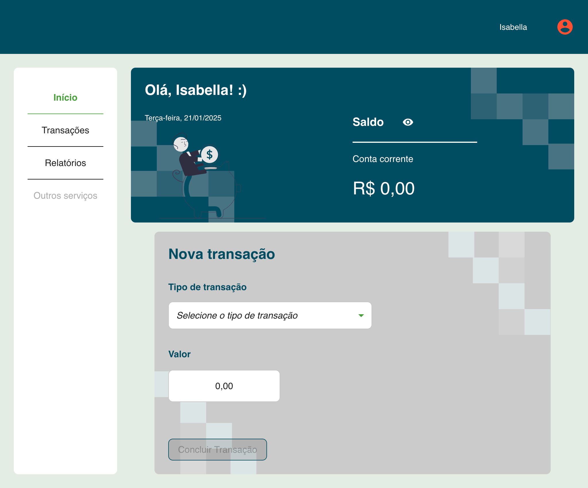
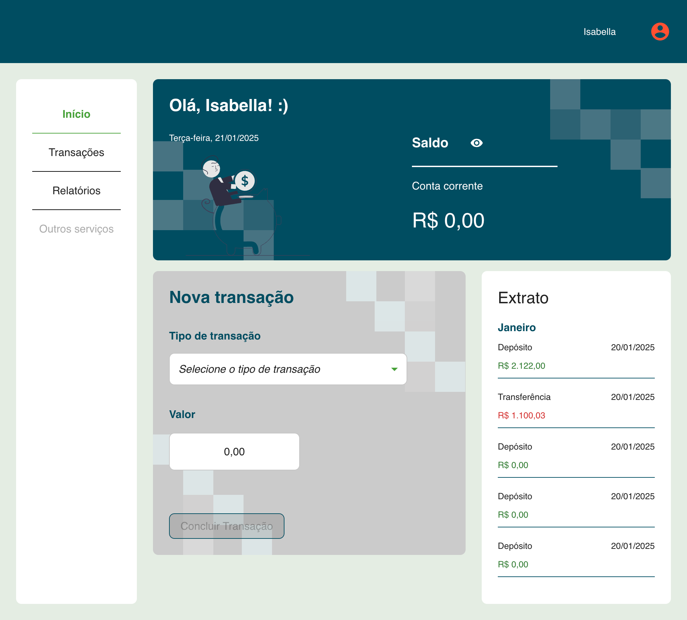

# Tech Challenge - Fase 2

## Projeto Financeiro

Projeto desenvolvido pelos alunos:

- Cristiano Santos Gonçalves - RM 358858

- Isabella Soares de Lima - RM 358599

## Sobre este projeto

Este repositório contém o projeto Bank App, refere-se ao microfrontend root da nossa aplicação. Na primeira entrega estávamos trabalhando com monorepos usando o Turborepo, porém enfrentamos diversos problemas no momento de implementar microfrontends nele, tanto usando Module Federation quando Single SPA, e por conta disso optamos por quebrar o projeto em pequenos novos repositórios e criar a comunicação entre eles utilizando **Module Federation**.

Outra mudança de arquitetura que derivou da quebra do monorepo foi a retirada do projeto do design system do repositório principal da aplicação. O projeto do design system agora existe [neste repositório](https://github.com/Desafio-Financeiro/financeiro-ds) e foi publicado como uma biblioteca no NPM para que pudesse ser consumido por todos os nossos microfrontends.

Para a entrega desta fase do projeto temos três microfrontends:

- **Bank App:** é a aplicação principal (_root_) para os nossos microfrontends;
- **Transactions:** é uma aplicação remota (_remote_), responsável por conter todas as regras de negócio relacionadas a transações e extrato;
- **Reports:** é uma aplicação remota (_remote_) escrita em Angular que contém todas as regras de negócio relacionadas aos relatórios financeiros adicionados nesta fase.

Neste projeto mantivemos o Next, que era um dos requisitos da primeira entrega. Nos demais microfrontends precisamos remover o Next devido dificuldades no momento da implementação dos module federation. Precisamos remover também a estratégia que estávamos seguindo de App Router, agora passamos a utilizar Page Router para permitir os microfrontends.

Neste projetos mantivemos apenas as funcionalidades que precisam ser compartilhadas entre todos os frontends:

- Gestão de usuários
- Criação de transações
- Componentes globais como Menu e Header
- Card global com as informações de saldo

Como o projeto anterior já possuía Typescript, para essa entrega não houveram modificações nesse requisito. Para gestão de estados estamos utilizando o Recoil, e nele guardamos informações sobre usuários, transações e saldos.

Apesar de a descrição do desafio prever que teríamos uma API fornecida pela FIAP para realizar integração, tivemos a necessidade de criar nossa própria API para realizar a entrega do projeto, pois não foi possível utilizar de forma satisfatória a API que nos foi fornecida. Na primeira entrega estávamos utilizando uma API construída no [mockapi.io](https://mockapi.io/), mas devido algumas limitações por conta das funcionalidades que precisávamos utilizar, optamos por utilizar uma API fake dentro do projeto utilizando [json-server](https://www.npmjs.com/package/json-server). A API é executa no mesmo script utilizado para inicializar a aplicação localmente.

Para o deploy optamos por utilizar o Amplify, e para executar o projeto configuramos um ambiente no Docker tanto para executar todos os microfrontends ao mesmo tempo quanto para executá-los de forma individualizada.

## Requisitos da entrega

- [x] Incluir gráficos de análise financeira
- [x] Filtros e pesquisa na listagem de transações
- [x] Paginação na listagem de transações
- [x] Validações nos formulários
- [x] Containerização da aplicação e seus componentes com Docker Compose
- [x] Deploy na cloud com Amplify
- [x] Microfrontends com Module Federation
- [x] Roteamento e comunicação entre microfrontends (acontece na criação de transações)
- [x] Uso de microfrontends para integrar diferentes frameworks
- [x] Gestão de estados com Recoil
- [x] Typescript
- [x] SSR (somente no app root)

## Como executar o projeto

### Executar apenas o app root (Bank App)

Crie um arquivo `.env` na raiz do projeto com o conteúdo:

```
NEXT_PUBLIC_API_URL=http://json-server-api-mu.vercel.app
NEXT_PUBLIC_TRANSACTIONS_APP_URL=http://localhost:3002
NEXT_PUBLIC_REPORTS_APP_URL=http://localhost:3001
```

Instale as dependências e execute o projeto:

```
npm i
npm run dev
```

A aplicação deve executar na url `http://localhost:3000`.



### Executar todos os microfrontends ao mesmo tempo

Crie um arquivo `.env` na raiz do projeto com o conteúdo:

```
NEXT_PUBLIC_API_URL=http://json-server-api-mu.vercel.app
NEXT_PUBLIC_TRANSACTIONS_APP_URL=http://localhost:3002
NEXT_PUBLIC_REPORTS_APP_URL=http://localhost:3001
```

Execute no terminal o comando:

```
docker compose up
```

Com este comando todos os microfrontends serão executados em containers e a aplicação completa deve executar na url `http://localhost:3000`.



## Sobre o Docker Compose

Escolhemos o app root para orquestrar todos os outros microfrontends via Docker Compose, sendo que cada um deles possui o seu próprio para execução individual.

Para estabeler comunicação entre eles dentro do container criamos uma network, e visto que cada microfrontend está em um repositório separado, o Docker Compose também fica responsável por clonar esses projetos e antes de executá-los.

## Links para acessar as aplicações

[Bank APP](https://main.d1m6z57r6zgdud.amplifyapp.com/)

[Transactions](https://main.d12mtbag2y0zom.amplifyapp.com/)

[Reports](https://main.d3pb86cilm3vn8.amplifyapp.com/)

[Landing page](https://main.d8ml3barfxfwu.amplifyapp.com/)

[API json-server](http://json-server-api-mu.vercel.app/)

[NPM do DS](https://www.npmjs.com/package/fiap-financeiro-ds)

## Links para acessar os repositórios dos microfrontends

[Bank APP](https://github.com/Desafio-Financeiro/bank-app)

[Transactions](https://github.com/Desafio-Financeiro/transactions)

[Reports](https://github.com/Desafio-Financeiro/reports)

[Landing page](https://github.com/Desafio-Financeiro/landing-page)

[API json-server](https://github.com/Desafio-Financeiro/json-server-api)

[Financeiro DS](https://github.com/Desafio-Financeiro/financeiro-ds)
